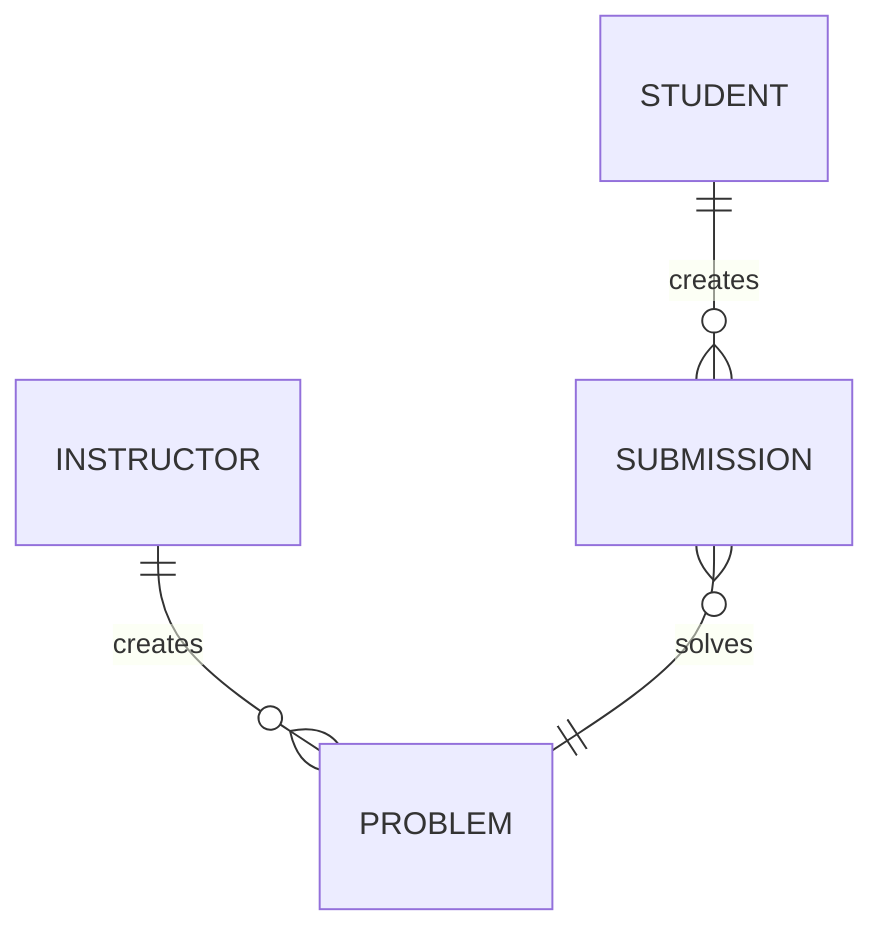

# Application domain types

| Entity     | Details                              |
| ---------- | ------------------------------------ |
| User       | Represents user of lit               |
| Problem    | Represents one task                  |
| Submission | Represents an attempts to solve task | 

